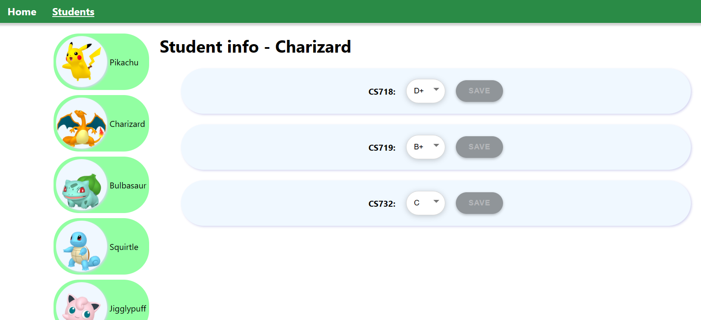

# CS719 - Practical Test three - Student Course Info Viewer
ddd
In this test, you will complete a _full-stack_ application allowing users to view courses taken by students, and to edit the grades for those courses. You will primarily be focusing on the _backend_ for this test (i.e. node.js / Express code, and database access), but will also be required to "hook up" the mostly-complete frontend with the backend.

Once complete, your application will look similar to this screenshot:



This is an open book test. You may use any bound printed or handwritten notes during the test. You may also use _most_ online or PC-based resources available to you, with the following exceptions:
- You **may not** use any email, chat programs, or other means of directly communicating with other people online.
- You **may not** use any generative AI software, including but not limited to GitHub Copilot, Microsoft Copilot, ChatGPT, and Gemini.
- You **may not** use Microsoft Edge browser or Microsoft Bing search engine.

Before you begin, **make sure to thoroughly read and understand the existing code!** This will help you greatly in being able to achieve the tasks below. Also remember to install dependencies for both the frontend and backend.

This project contains database access code (including an SQL init script), API code, and SvelteKit frontend code.

This test is marked out of **60 marks** in total. There are four steps below - please complete all steps. Make sure to commit and push regularly.

## Step One - Displaying students (10 marks)

For the first step, let's get our students displaying in the frontend.

As you will already know from reading the code, we have an API route already defined which gets all student data as JSON, upon a `GET` request to `/api/students`. This data needs to be displayed on the `/students` page on the frontend.

We have a `load()` function defined in our frontend, in the `routes/students/+layout.js` file. Currently this returns an empty array of studnets. Modify this function to instead fetch the data from your backend, and return it.

**Hint:** The provided `STUDENTS_URL` constant contains the correct URL to fetch from.

Once complete, when you navigate to <http://localhost:5173/students> in the frontend (while your backend is running), you should see the list of students (Pokemon) on the lefthand side.

## Step Two - Displaying courses (15 marks)

Next, we will complete the backend to obtain a list of course data for a particular student, then hookup the frontend to display it.

### 2.1 - Backend _(10 marks)_

In the backend project, add a new route handler to handle `GET` requests to `/api/students/:studendId/course-data`. You may include this in the existing `api-students.js` file, or create your own new route handler file (and add it to `api.js`) - it's up to you.

When you receive a request to this handler, get a list of all rows from the `StudentCourses` table in the database, where the `studentId` is equal to the `studentId` provided in the path parameter.

- If the data exists, return it as JSON.

- Otherwise, return a `404` response.

**Hint:** The database access code for this step is already provided to you - check the files in the `data` folder to see which functions you can use.

### 2.2 - Frontend _(5 marks)_

To complete Step Two, we will hook up the frontend to our new backend API route. To do this, complete the `load()` function in the frontend's `routes/students/[studentId]/+page.js` file. Currently we are already returning the `student`, along with an empty array of course data. Instead, modify this function so that the `student` is returned, along with the course data as fetched from your API route you just created in step 2.1.

Once complete, you should now be able to click on any of the students (Pokemon) in the list, and be able to view their course data in your webapp. Different Pokemon have taken different courses (between one - three courses each), so you should see the data on the page change as you select different Pokemon. The Pokemon name in the header should also change.

## Step Three - Updating grades (25 marks)

In this step, we will allow users to update grades. There are three parts to this, as below:

### 3.1 - Database access _(10 marks)_

First, let's complete the database access code for this step. In `student-courses-dao.js`, complete the `updateGrade()` function. This function receives `updateData` as an argument, which contains a `studentId`, `studentCourseId`, and `grade`.

This function should perform an SQL `UPDATE` statement on the `StudentCourses` table, to set the `grade` to the given value, where the `id` equals the provided `studentCourseid`, and the `studentId` equals the provided `studentId`.

The function should return `true` if any rows were updated, and `false` otherwise.

**Hint:** For now, you can assume that `updateData` will always contain a valid `studentId`, `studentCourseId`, and `grade`, but you might need to use `parseInt()` to convert `studentId` and `studentCourseId` to numbers.

### 3.2 - Backend _(10 marks)_

Next, let's use the `updateGrade()` function. Create a new API route handler function for `PATCH` requests to `/api/students/:studentId/course-data/:studentCourseId`. You may include this in the existing `api-students.js` file, or use your own route handler file if you created one in the previous step.

This function should create a new object to pass to the `updateGrade()` function, containing the required `studentId`, `studentCourseId`, and `grade` properties. The first two of these values should be obtained from the path parameters, and the `grade` should be obtained from the request body:

```js
const updateData = {
  studentId: null, // TODO Get from req.params
  studentCourseId: null, // TODO Get from req.params
  grade: null, // TODO Get from req.body
};
```

Next, your handler should call `updateGrade()` appropriately. If `updateGrade()` returns `true`, then return a `204` response code back to the client. Otherwise, return a `404` to the client.

### 3.3 - Frontend _(5 marks)_

Finally in this step, let's hookup the frontend to our new API route.

In `routes/studetns/[studentId]/+page.svelte`, we have a `handleSaveCourseData()` function. Complete this function so it sends a request to your API route developed in step 3.2.

If the response is _not_ 204, then you should display an `alert()` box to the user, informing them of the unexpected status code.

**Hint:** All data required is either already provided to you in `e.detail`, or is available in `data.student`.

**Hint 2:** Remember that this one is a `PATCH` request, not a `GET` request...

After completing this step, you should be able to modify any student grade. Then, if you refresh the page, or navigate away and come back, the saved data will have persisted. It will even persist if you shutdown the server and restart it, because the data is stored in the database.

## Step Four - Data validation (10 marks)

For the final step, let's add some data validation. Our frontend already works fine at this point, but it's best to include proper data validation in case a careless or malicious user tries to access your API directly using Postman or a similar tool.

In our case, we want to add validation to the "update grade" functionality, to prevent users from deleting grades, or uploading invalid grades.

Modify your `updateGrade()` function to add the following data validation:

1. `updateData` _must_ contain three properties: `studentId`, `studentCourseId`, and `grade`.

2. `studentId` and `studentCourseId` must be _integers_.

3. `grade` must be a _string_, and must be one of the values contained in the provided `VALID_GRADES` array.

If all three of these criteria are satisfied, the function should perform as normal. Otherwise, it should `throw` an error. You can handle this error in your "update grade" API route, to return a `422` status code back to the client.

**Hints:** You may implement this any way you choose, but the [`yup`](https://www.npmjs.com/package/yup) NPM package is recommended as, once you define the schema, you can easily handle parsing `updateData` into a verified version, and `yup` will throw errors if the incoming data is invalid.

If you do use `yup`, then its `oneOf()` function will be very helpful to ensure that the incoming `grade` matches one of the `VALID_GRADES`.
